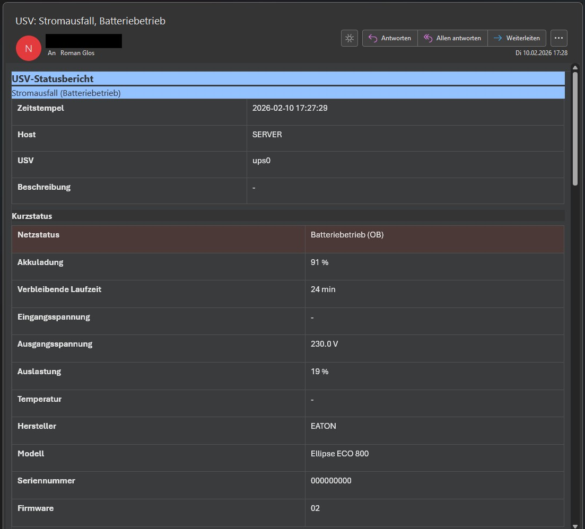
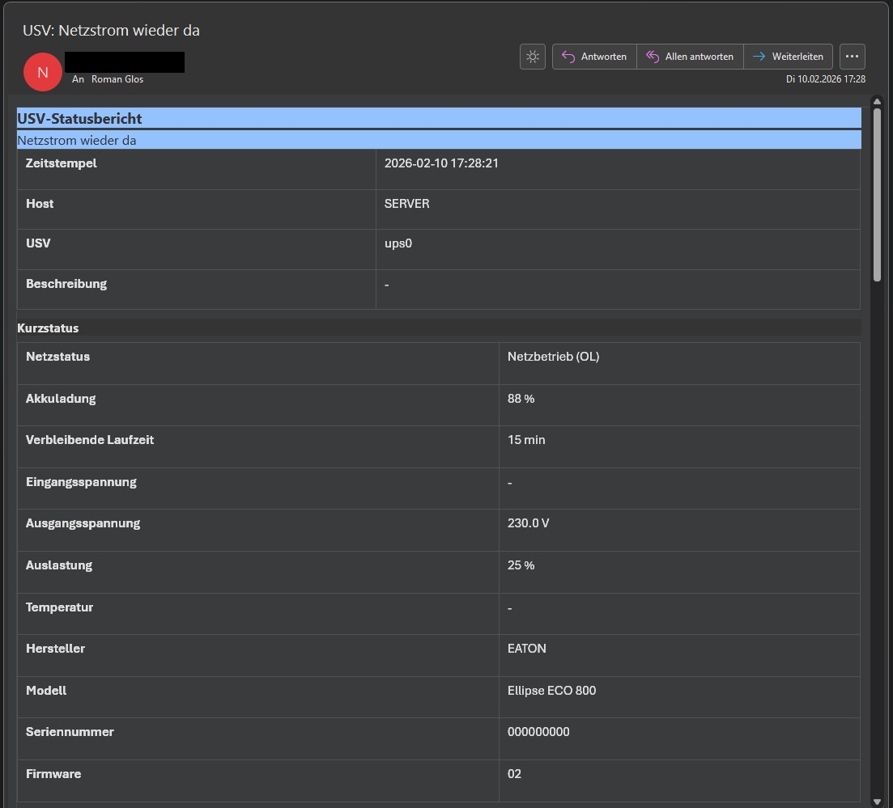

# USVWatch (UGREEN NAS)

USVWatch ist ein leichtgewichtiges Monitoring-Skript für UGREEN NAS mit UGOS Pro.
Es liest den Status einer USV (UPS) über NUT aus und versendet bei Ereignissen und Schwellwerten einen Outlook-freundlichen HTML-Report per E-Mail.

## Features

- NUT-Statusabfrage über den USV-Dienst von UGOS Pro, Standard: `127.0.0.1:3493`
- Ereignisbasierte Benachrichtigungen, z. B. Stromausfall, Batteriebetrieb, Netzstrom wieder da, Batterie kritisch
- Schwellwerte für Akkuladung und verbleibende Laufzeit
- Anti-Spam durch Statusspeicherung, Benachrichtigung nur bei Wechsel, optional mit Re-Send
- Optionaler Tagesreport zu einer festen Uhrzeit
- Optional: NUT Instant Commands anzeigen und ausführen
- Outlook-freundlicher HTML-Report per E-Mail
- Python 3, nur Standardbibliothek, keine externen Abhängigkeiten

## Screenshots

| Stromausfall (Batteriebetrieb) | Netzstrom wieder da |
|---|---|
|  |  |

## Projektstruktur

```text
USVWatch/
├─ README.md
├─ LICENSE
├─ Screens/
│  ├─ USVWatchv1DE.jpg
│  ├─ USVWatchv1DE2.jpg
│  └─ USVWatchv1EN.jpg
├─ usvwatch/
│  ├─ usvwatch.py
│  ├─ usvwatch.env
│  └─ usvwatch-loop.sh
└─ USVWatch_Handbuch_Manual_DE-EN_v2.pdf
```

## Voraussetzungen

- UGREEN NAS mit aktiviertem USV- oder UPS-Dienst (NUT)
- Python 3
- SMTP-Server für den Mailversand

## Installation (Quickstart)

1. Repository oder Ordner auf das NAS kopieren, zum Beispiel nach:

```bash
/volumeX/docker/usvwatch/
```

2. Konfiguration anpassen:

- Datei `usvwatch/usvwatch.env` bearbeiten
- Pflichtfelder für den Mailversand setzen:
  - `SMTP_HOST`
  - `MAIL_FROM`
  - `MAIL_TO`

3. Optional zuerst den aktuellen Status prüfen:

```bash
cd /volumeX/docker/usvwatch/usvwatch
/usr/bin/python3 usvwatch.py --print-status
```

4. Testmail senden:

```bash
cd /volumeX/docker/usvwatch/usvwatch
/usr/bin/python3 usvwatch.py --test-mail
```

5. Loop-Skript ausführbar machen und starten:

```bash
chmod +x usvwatch-loop.sh
./usvwatch-loop.sh start
```

6. Status und Log prüfen:

```bash
./usvwatch-loop.sh status
./usvwatch-loop.sh tail
```

7. Stop und Restart:

```bash
./usvwatch-loop.sh stop
./usvwatch-loop.sh restart
```

## CLI-Optionen

```bash
python3 usvwatch.py --print-status
python3 usvwatch.py --test-mail
python3 usvwatch.py --list-commands
python3 usvwatch.py --run-cmd <CMD>
python3 usvwatch.py --run-cmd <CMD> --run-cmd-mail
```

Ohne Parameter läuft `usvwatch.py` genau einmal und eignet sich damit auch für Cron:

```bash
python3 usvwatch.py
```

Optional kannst du eine andere ENV-Datei laden:

```bash
python3 usvwatch.py --env /pfad/zur/usvwatch.env --test-mail
```

## Konfiguration (`usvwatch.env`)

### Allgemein

- `USVWATCH_LANG=de`
- `HOST_LABEL=`  
  Optionaler Hostname in der E-Mail. Falls leer, wird der System-Hostname verwendet.
- `STATE_DIR=.`  
  Speicherort für Statusdateien
- `DEBUG=0`

### NUT

- `NUT_HOST=127.0.0.1`
- `NUT_PORT=3493`
- `NUT_TIMEOUT=5`
- `NUT_UPS_NAME=`  
  Leer lassen, wenn nur eine USV vorhanden ist
- Optional bei Authentifizierung:
  - `NUT_USERNAME=nut`
  - `NUT_PASSWORD=nut`

### SMTP

- `SMTP_HOST=`
- `SMTP_PORT=587`
- `SMTP_TLS=starttls`  
  Mögliche Werte: `starttls`, `ssl`, `none`
- `SMTP_TLS_VERIFY=1`
- `SMTP_USER=`
- `SMTP_PASS=`
- `SMTP_TIMEOUT=15`
- `MAIL_FROM=`
- `MAIL_TO=`  
  Mehrere Empfänger kommasepariert
- Optional:
  - `MAIL_CC=`
  - `MAIL_BCC=`

### Alerts

- `ALERT_ON_BATTERY=1`
- `ALERT_BACK_ONLINE=1`
- `ALERT_LOW_BATTERY=1`
- `ALERT_CHARGE_LOW=1`
- `ALERT_RUNTIME_LOW=1`
- `ALERT_UNREACHABLE=1`
- `ALERT_RECOVERED=1`

### Schwellwerte

- `CHARGE_THRESHOLD_PERCENT=20`
- `RUNTIME_THRESHOLD_MIN=10`

### Re-Send

- `THRESHOLD_RESEND_MIN=60`
- `UNREACHABLE_RESEND_MIN=120`

### Tagesreport

- `ENABLE_DAILY_REPORT=0`
- `DAILY_REPORT_TIME=09:00`

### Darstellungsoptionen für die Mail

- `INCLUDE_ALL_VARS=1`
- `INCLUDE_STATUS_LEGEND=1`
- `ADD_HUMAN_STATUS_FIELD=1`
- `ALL_VARS_INCLUDE_REGEX=`
- `ALL_VARS_EXCLUDE_REGEX=`

## Hinweise zum Loop-Skript

Das Loop-Skript unterstützt folgende Aufrufe:

```bash
./usvwatch-loop.sh start
./usvwatch-loop.sh stop
./usvwatch-loop.sh restart
./usvwatch-loop.sh status
./usvwatch-loop.sh tail
```

Wichtig: In der ursprünglich hochgeladenen Version war `restart` defekt, weil `stop()` das Skript sofort mit `exit 0` beendet hat. Dadurch wurde `start()` bei `restart` nie mehr erreicht. Verwende deshalb die unten verlinkte überarbeitete Version von `usvwatch-loop.sh`.

## Dokumentation

- [Handbuch (PDF)](USVWatch_Handbuch_Manual_DE-EN_v2.pdf)

## Lizenz

Dieses Projekt steht unter der MIT-Lizenz. Siehe [LICENSE](LICENSE).

## Autor

Copyright (c) 2026 Roman Glos
